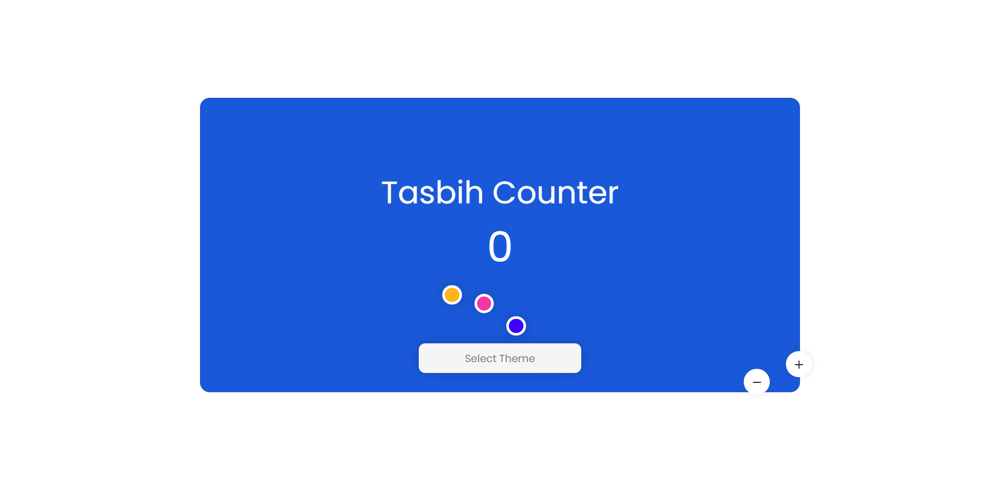

# Tasbih-Counter
A simple JS project for a Tasbih Counter with the feature of switching themes of your own choice. Actually, its sort of a digital tasbhih for those who are not carrying
any and are willing to offer some duas. Apart fromthis, this counter can also be used for counting purposes.
 

## Description
When this app will be running, the Interface will appear on the screen. At right there will be button for adding and subtractibg values from the counter. The user simply have to click on the buttons 
to perform the calculation whereas, he\she can offer their recitations.
 

## Features
- One of the main feature is the Interactive User Interface that makes this app easy to use withjust one click.
- The UI provides multiple themes for this appplication. The user can switch these themes with just one click
 

## Demo
> :no_entry: No preview available
 

## Link to Video
 

## GUI

 

## Technoloy Stack
The languages used are

- **HTML** &nbsp; &nbsp; &nbsp; &nbsp; For Wrtiting the Structural Script of UI
- **CSS** &nbsp; &nbsp; &nbsp; &nbsp; For Desigining the Web Page
- **JS** &nbsp; &nbsp; &nbsp; &nbsp; For Adding functionalities to the page.

## Advancement
> The current project does hold the condition that the counter should not get to the negative value. So, this can be simplified in future.
 

## Developer
Muhammad Abdullah Butt  
abdullahbutt12292210@gmail.com  
> [Instagram](https://www.instagram.com/abdullah.butt.22/)
> [FaceBook](https://www.facebook.com/profile.php?id=100076291614529)
> [YouTube](https://www.youtube.com/channel/UCnuOFQyMywg-KuoN-lmav1Q)
> [Portfolio](https://rebrand.ly/muhammadabdullahPortfolio)
> [Website](#)
